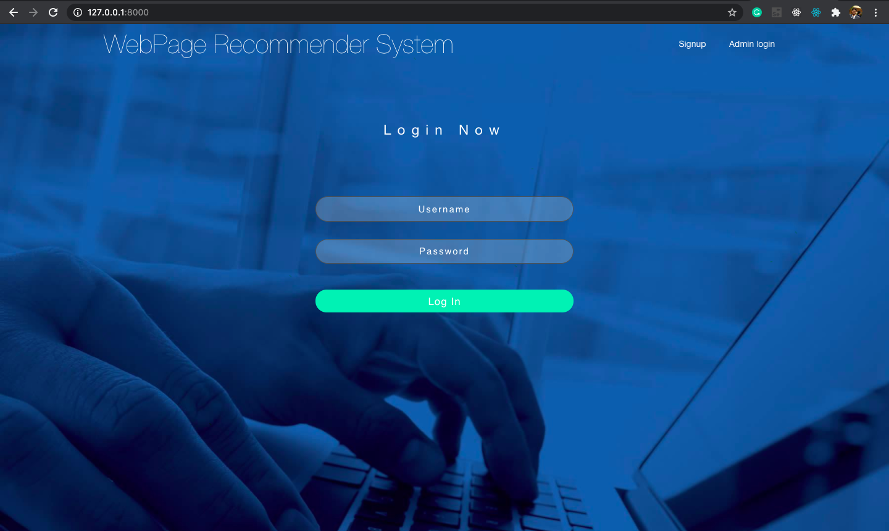
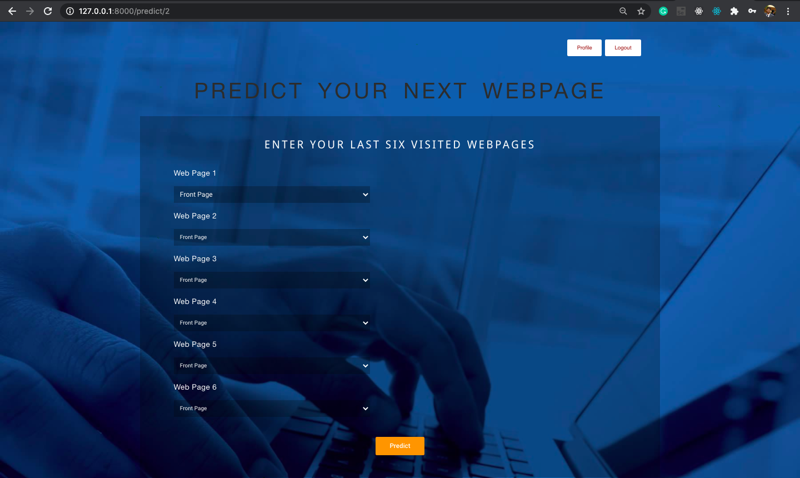
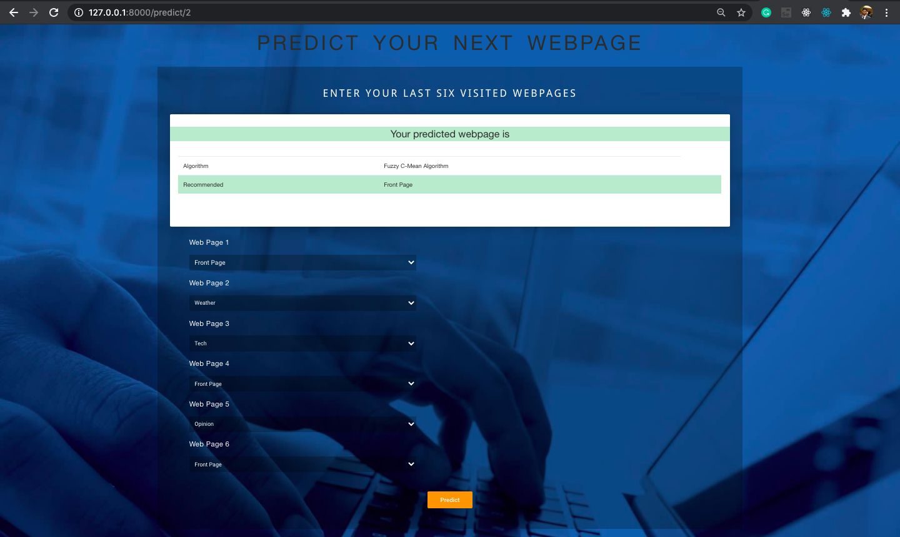

# WebPage-Recommender-System
>The aim of this project is to predict the WebPage based on previous 6 six webpage searched i.e., based on previous 6 parameters.

It supports following features:

*	Login/ Sign Up 
*	Viewing and Editing Profile 
*	User can enter the values of various i.e., 6 parameters on the basis of which the Webpage has to be predicted.

 
 

  
 

 
 
 

  
 

                                                                           
Quick start
-----------
1. (optional) create virtual env ex. mkvirtualenv mytest_env
2. pip install -r requirements.txt
3. python manage.py migrate
4. python manage.py runserver

